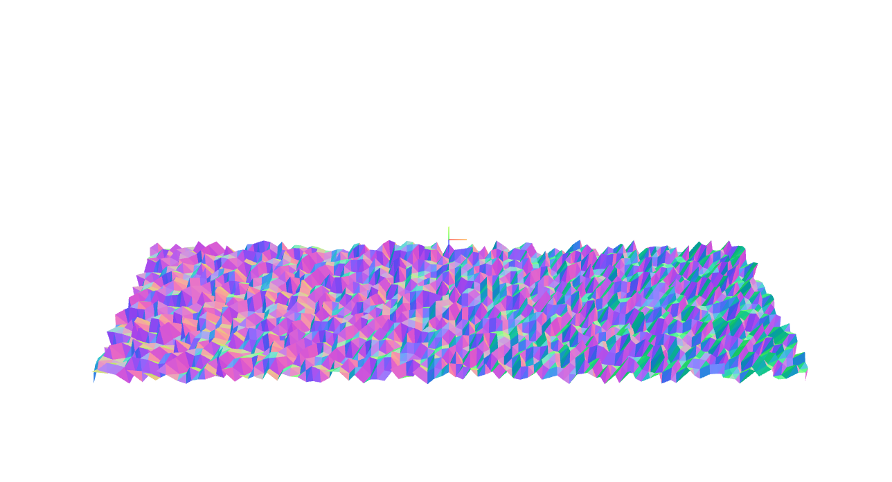

Dynamic Geometry
==================

A quick example of how to create an on-the-fly dynamic geometry.

The key is in how the faces are drawn on the veracities - as the order is extremely important!

[Quick Demo](http://bkach.github.io/dynamicGeometry)